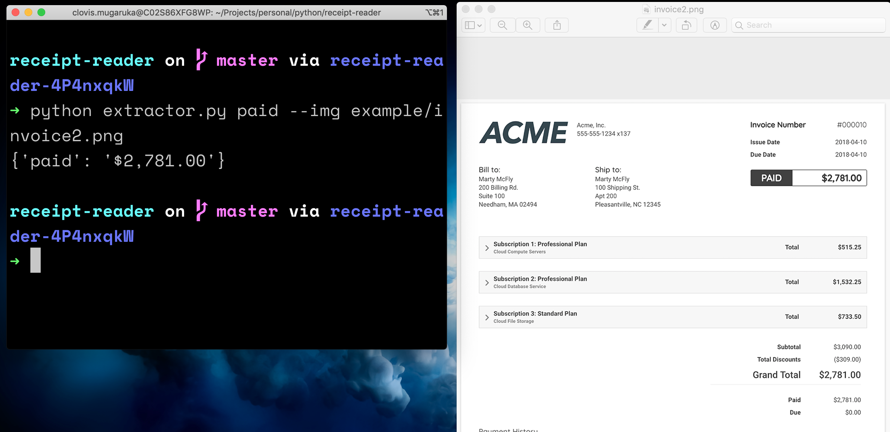

# Pytesseract Demo

[Throwaway code](https://stackoverflow.com/questions/1373980/good-strategies-for-developing-throwaway-code) that shows how [pytesseract](https://pypi.org/project/pytesseract/) can be used
to do intereting things with data:smiley:


#### Prerequisite
+ [Python](https://www.python.org/downloads/)
+ [Pipenv](https://pipenv.pypa.io/en/latest/)

#### Usage
1. Clone the app

```console
$ git clone https://github.com/clovisphere/pytesseract-demo.git
```
2. To bring to life your setup :stars: :rocket:

```console
$ cd myproject # this repo
$ pipenv --python 3
$ pipenv install
$ pipenv shell
```



Enjoy :v::sunglasses: